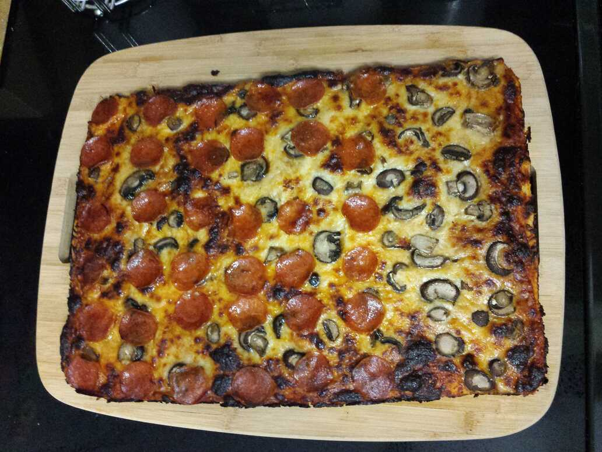

# Buffalo-style Pizza

Quick preparation: start cooking the pizza sauce, then start the dough.
Once the dough is in the oven rising, turn the heat off on the sauce but
leave it in place on the stove, slowly cooling until it's needed. It will
be about 2–2.5 hours between starting and sitting down to eat the pizza,
though it will not require continuous attention.

## Dough

* 1c water
* ~2tsp dry active yeast
* 0.5tsp sugar
* 1tsp salt
* 300g (~2.5c) bread flour
* olive oil

Heat the water in the microwave to 110–120F, pour into a large bowl. Add
the sugar and the yeast to a large bowl. Whisk salt into the flour. Wait a
few minutes for the yeast to wake up, then gradually mix the flour with a
spatula.

Empty contents onto a floured surface and knead for about 10 minutes. The
dough should be dry enough not to stick to your hands, but no dryer. The
result should stretch but not tear easily.

Place the dough ball back in the bowl and coat lightly in olive oil to
keep it from drying out. Cover with a plate or towel, then let sit in a
turned-off oven for 1–2 hours to rise.

## Pizza

* 6oz tomato paste
* garlic powder, onion powder, red pepper flakes, oregano
* 1tsp salt
* 2tsp sugar
* 1c water
* 16oz (~4c) shredded cheese
* 72 pepperoni slices
* olive oil

Heat a bit of olive oil in a pan over medium-high heat. Add tomato paste
and saute for 3–4 minutes until the tomato paste starts to caramelize on
the bottom of the pan. Add water, sugar, salt, and spices to taste. Stir
into a uniform pizza sauce and reduce heat to low. Stir occasionally until
the sauce reduces to your desired thickness. Turn off the heat and reserve
until needed.

Preheat the oven to 500F. Lightly, but very thoroughly, grease a half
sheet pan with olive oil. Press, stretch, and pull pizza dough until it
fills the prepared pan, going all the way to the corners. Patience.

Top the dough with the cooled sauce, leaving the desired amount of crust.
Sprinkle cheese over the sauce, then add pepperoni and/or other toppings.
Place in the center of the oven and bake for 20 minutes.

Let sit 10 minutes *in the pan* after removing the pizza from the oven.
The bottom crust will continue cooking in the hot oil outside of the oven,
turning into a golden brown. Besides, it will be way to hot to eat anyway.

Remove pizza from pan onto a large cutting board and cut into 12 slices.
Each slice will be around 260 calories.

## References

* [Buffalo Style Pizza](https://www.youtube.com/watch?v=0pnsU0-kGDA)
