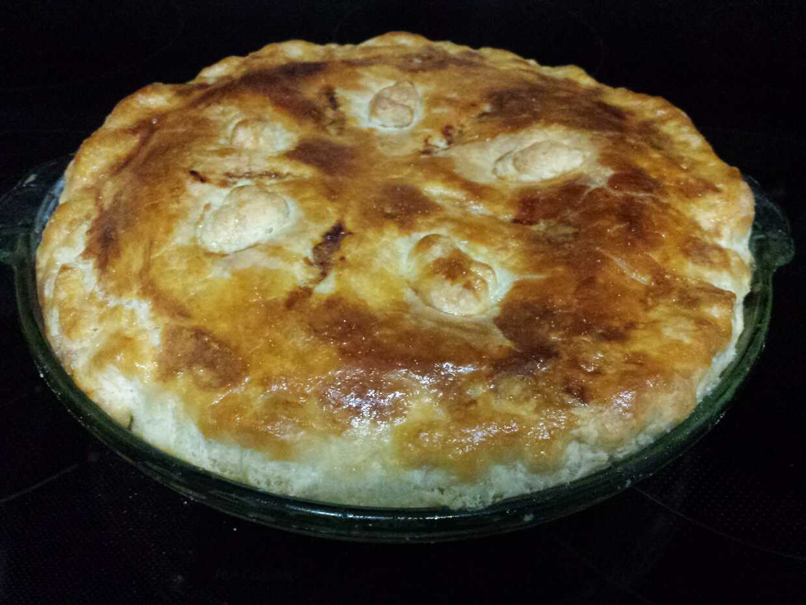

# Chicken Pot Pie

The ultimate comfort food.

* 2tbps butter
* 1 bag frozen peas
* chopped carrots
* chopped onion
* 2c (1 can) chicken broth
* 0.5c heavy cream
* ~1.5lbs boneless, skinless chicken
* 0.25c flour
* 1 egg, whisked

Dice chicken into ~1-inch cubes. Heat butter in a pan, add salt, onions
carrots, and saute. Add chicken, brown, and caramelize a bit to the pan.
Add flour and cook for a few minutes. Add broth, peas, and cream, then
reduce to desired thickness while aggressively scraping the bottom of the
pan.

Remove from heat to cool slightly, roll out a pie crust, and place it into
a pie pan. Fill the pie, then cover with second pie crust. Crimp, cut
vents, and brush some of the egg over the top crust. Bake at 425F for
30–35 minutes.

With 8 slices, each slice will be around 600 calories. Goes *very* well
with my biscuits, which act as additional crust to soak up the excess
filling.

## References

* [Pie Crust](pie-crust.md)
* [Wellons Biscuits](biscuits.md)
* [Chicken Pot Pie (Natasha's Kitchen)](https://www.youtube.com/watch?v=W1XELWKaCi4)
* [Chicken Pan Pie (Food Wishes)](https://www.youtube.com/watch?v=aktVv2FsYBs)
