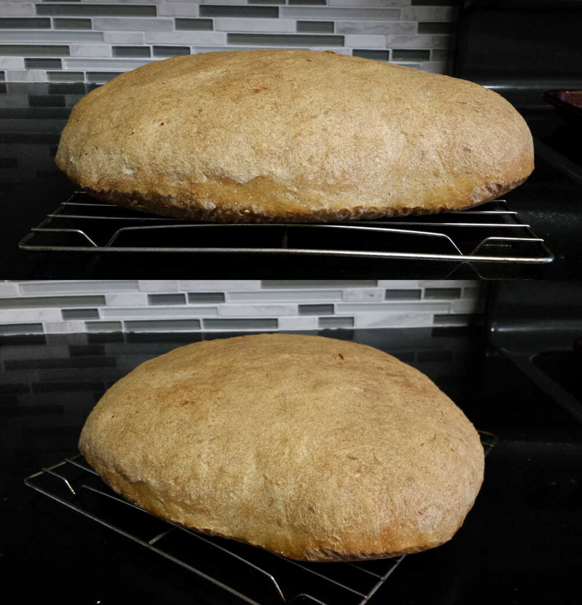

# Country Bread

The flour makes a big difference in the result, so if it doesn't turn out
well, try a different brand of flour. The bread is best when fresh and is
great when hosting guests. However, it quickly looses quality over 2–3
days, then it begins molding, so eat it quickly.

* 650g bread flour
* 0.25tsp yeast
* 2c water
* 1.5tsp salt

Whisk the flour, salt, and yeast together dry in a large bowl. Gradually
add water, mixing and scraping with a spatula. Cover and let rise in a
turned-off oven for around 18 hours. The long rise means it no kneading is
required.

After rising it will be bubbly with a strong fermentation smell. Use a
spatula to scrap away from the surface, folding over itself, making
several passes around the bowl. Empty onto a well-floured surface, and
split into two halves. Roll and fold each until it has a nice skin, place
each separately on a pan, and let rise an additional 2 hours. Then bake at
450F for 30 minutes, producing two loaves.

## References

* [No-Knead Country Bread](https://www.youtube.com/watch?v=7rWeCYdtkwI)
