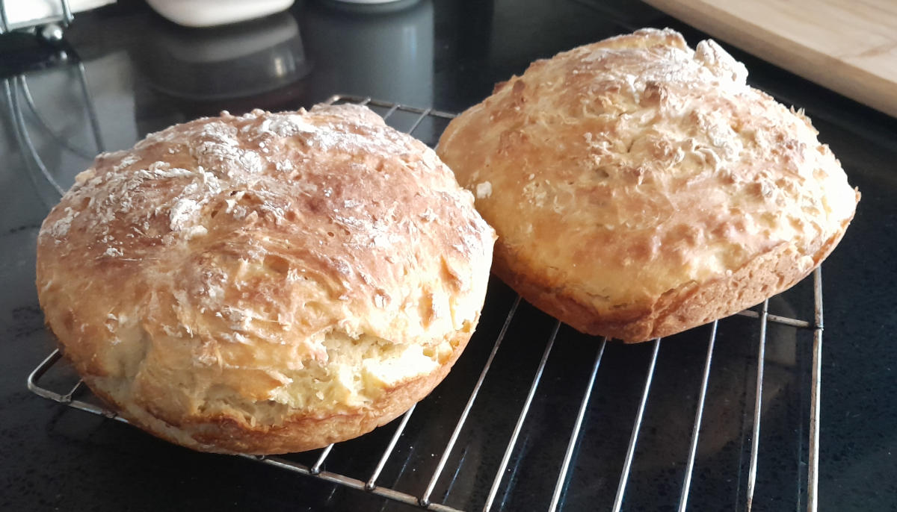

# "French" Bread

* 500g (~4c) all purpose flour
* 30g sugar
* 10g salt
* 2tsp active dry yeast
* 1c warm milk (~110F)
* 2 eggs
* 2 tbps melted butter

Add the yeast to the warm milk to get it started. Whisk the eggs. Mix the
dry ingredients in a large bowl then create a depression in the center.
Pour the wet ingredients into the depression and mix. Mix in additional
warm water until the dough comes to the consistency of a thick batter.
Flour the outside of the dough to make it easier to remove from the bowl
after rising. Place a damp cloth over the bowl and let it rise for an
hour.

Preheat oven to 400F. Place risen dough into cooking vessels, or whatever
form you wish, and bake for 25 minutes or until the top appears done. Let
cool completely on a rack before serving.

## References

* [Ancient Bread: Simple 350 Year Old Recipe](https://www.youtube.com/watch?v=Y0LLBZ8Z0qM)
