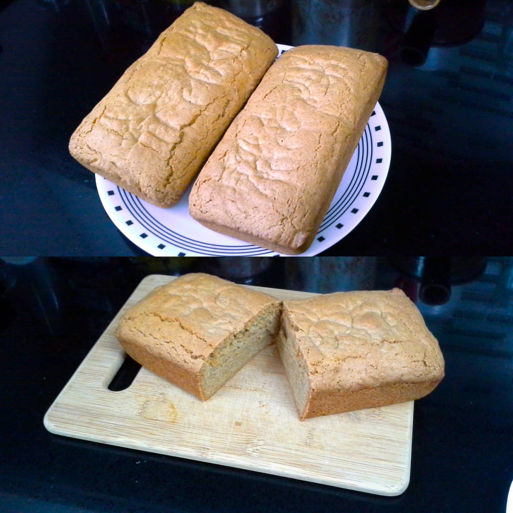

# Gingerbread

* 3c flour
* 1tsp baking powder
* 1tsp baking soda
* 1tsp ground cinnamon
* 1tsp ground ginger
* 2 large eggs
* 1.5c white sugar
* 1.5tsp vanilla extract
* 0.75c melted butter

Vigorously whisk the eggs and sugar together in a large bowl. Whisk in the
remaining dry ingredients. Melt butter in the microwave and whisk into the
large bowl.

Fold and stir flour into the mixing bowl. Generously butter two pans and
split the bowl contents between them, pressing it down. Bake in an oven
preheated to 350F for 35–40 minutes. A toothpick poked in the center
should come out clean. Let cool completely.

Cooled leftovers go very well with yogurt.

## References

* [Chef John's Zucchini Bread](https://www.youtube.com/watch?v=prJTrPRCf9o)
